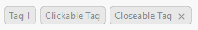
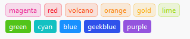
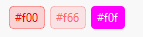
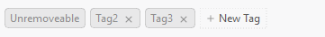
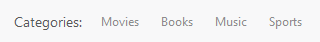

# Tag for Dayu Widgets
进行标记和分类的小标签。

## 何时使用
* 用于标记事物的属性和维度。
* 进行分类。


## 安装
```pip install dayu-widgets-tag```

## 导入模块
```python
from dayu_widgets_tag import MTag, MNewTag, MCheckableTag
```

## 代码演示

### 基础




```python
tag1 = MTag('Tag 1')
tag2 = MTag('Clickable Tag').clickable()
tag3 = MTag('Closeable Tag').closeable()
```
[查看完整代码](https://github.com/muyr/dayu_widgets_tag/tree/master/examples/basic.py)

可以通过链式调用`clickable`使得标签可以点击，并且鼠标指向标签的时候，鼠标形状会变成小手的形状，当点击的时候有`sig_clicked`信号发射。
可以通过链式调用`closeable`使得标签可以通过`x`按钮关闭，当关闭之后有`sig_closed`信号发射。

### 标签样式

可以通过`set_dayu_color(color)`来设置，也可通过`coloring(color)`链式调用。

可以通过`no_border()`来取消`border`样式，使用`dayu_color`颜色填充背景色

我们可以使用`dayu_widgets`中的`dayu_theme`里面的预设颜色。



```python
from dayu_widgets import MFlowLayout, dayu_theme

preset_color_lay = MFlowLayout()
for index, (text, color) in enumerate([
    ('magenta', dayu_theme.magenta),
    ('red', dayu_theme.red),
    ('volcano', dayu_theme.volcano),
    ('orange', dayu_theme.orange),
    ('gold', dayu_theme.gold),
    ('lime', dayu_theme.lime),
    ('green', dayu_theme.green),
    ('cyan', dayu_theme.cyan),
    ('blue', dayu_theme.blue),
    ('geekblue', dayu_theme.geekblue),
    ('purple', dayu_theme.purple),
]):
    tag = MTag(text)
    tag.set_dayu_color(color)
    if index > 5:
        tag.no_border()
        preset_color_lay.addWidget(tag)
```

[查看完整代码](https://github.com/muyr/dayu_widgets_tag/tree/master/examples/colorful.py)

也可以自定义颜色



```python
custom_color_lay = MFlowLayout()
custom_color_lay.addWidget(MTag('#f00').coloring('#f00'))
custom_color_lay.addWidget(MTag('#f66').coloring('#f66'))
custom_color_lay.addWidget(MTag('#f0f').coloring('#f0f').no_border())
```

[查看完整代码](https://github.com/muyr/dayu_widgets_tag/tree/master/examples/colorful.py)

### 动态添加和删除



```python
# __init__

    self.tag_lay = MFlowLayout()
    self.tag_lay.addWidget(MTag('Unremoveable'))
    self.tag_lay.addWidget(MTag('Tag2').closeable())
    self.tag_lay.addWidget(MTag('Tag3').closeable())
    
    add_tag = MNewTag('New Tag')
    add_tag.sig_add_tag.connect(self.slot_add_tag)
    self.tag_lay.addWidget(add_tag)

@Slot()
def slot_add_tag(self, text):
    tag = MTag(text).closeable()
    self.tag_lay.insertWidget(self.tag_lay.count() - 1, tag)

```

[查看完整代码](https://github.com/muyr/dayu_widgets_tag/tree/master/examples/add_delete.py)

### 可选择标签

`MCheckableTag`是可以点击选择，取消选择的 `Tag`，继承自 `QCheckBox`，你可以直接将它当作 `QCheckBox`来使用



```python
topic_lay = QHBoxLayout()
topic_lay.addWidget(QLabel('Categories:'))
for i in ['Movies', 'Books', 'Music', 'Sports']:
    topic_lay.addWidget(MCheckableTag(text=i))
topic_lay.addStretch()
```

[查看完整代码](https://github.com/muyr/dayu_widgets_tag/tree/master/examples/checkable.py)

## API

### MTag

继承自： `QLabel`

#### Properties

* `dayu_color`: str 标签的颜色

#### Public Functions

* `MNewTag(text='New Tag', parent=None)`
* `get_dayu_color()` 获取标签的颜色
* `set_dayu_color(str)` 设置标签的颜色
* `coloring(str)` 效果同`set_dayu_color`，支持链式调用
* `closeable()` 设置为可关闭，支持链式调用
* `clickable()`设置为可点击，支持链式调用
* `no_border()`去掉 border，改为填充样式，支持链式调用

#### Signals

* `sig_clicked()`标签被鼠标左键点击时发射
* `sig_closed()`标签被关闭时发射

### MCheckableTag

继承自：`QCheckBox` 

仅仅修改样式和 `setCheckable(True)`，没有增加任何方法。

API 请参考`QCheckBox`

### MNewTag

继承自：`QWidget`

#### Public Functions

* `MNewTag(text='New Tag', parent=None)`
* `set_completer(QCompleter)` 设置进入编辑模式时的 Completer

#### Signals

* `sig_new_tag(str)` 用户输入完成回车后发射，参数为用户输入的内容

